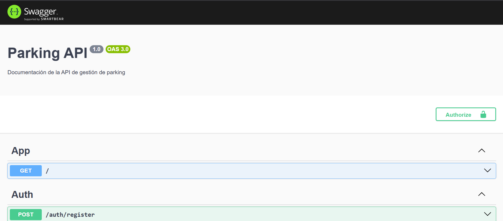
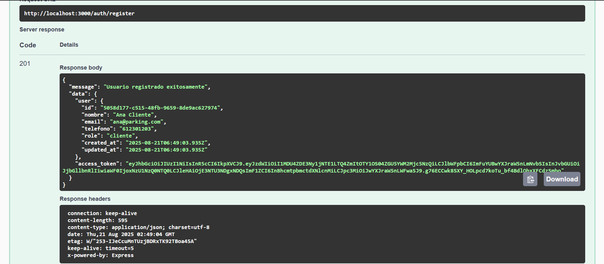
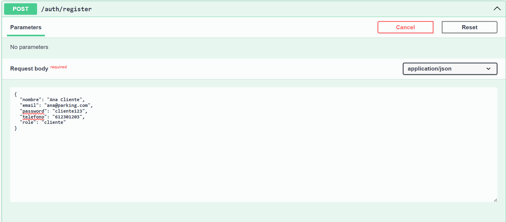
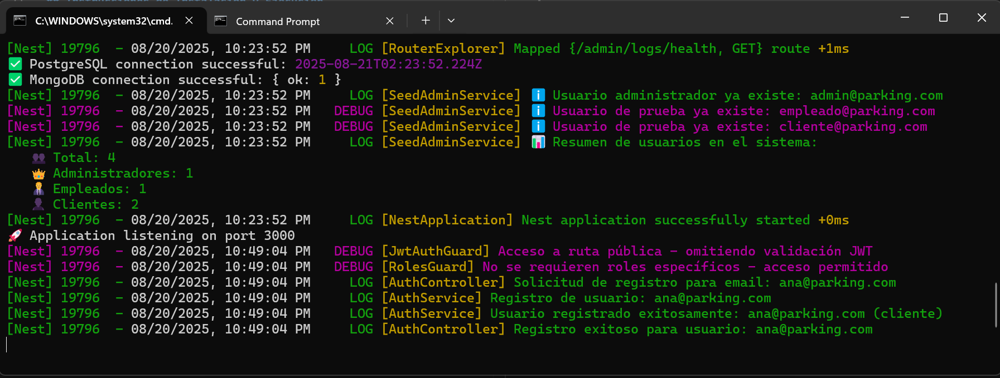

# 🚗 API de Parking

## 📋 Descripción del proyecto
```markdown
API RESTful construida con Node.js y NestJS para la gestión completa de un sistema de aparcamiento. La aplicación permite reservar plazas de parking para vehículos, consultar la ocupación actual, gestionar usuarios con roles administrativos, empleados y clientes, y acceder a logs detallados de auditoría. Utiliza autenticación basada en JWT y autorización por roles para controlar el acceso a las funcionalidades. La persistencia combina PostgreSQL para las entidades principales y MongoDB para almacenar logs de actividad.

```
---

## Instrucciones de Instalación y Ejecución 

### Requisitos previos

- Node.js (versión 18 o superior recomendada)
- npm o pnpm como gestor de paquetes
- PostgreSQL instalado y en funcionamiento
- MongoDB instalado y en funcionamiento
- Configuración correcta de las variables de entorno (ver `.env`)

### Clona el repositorio

```bash
git clone https://github.com/carlosdanielclark/parking-api
```

### Configuración de la base de datos

1. Crear la base de datos en PostgreSQL (por ejemplo `parking_db`).

```bash
createdb parking_db
```

2. Asegurar que MongoDB está corriendo y accesible (configurado por defecto en `localhost:27017`).

### Variables de entorno

Asegúrese de configurar el archivo `.env` en la raíz del proyecto con los siguientes valores ajustados a su entorno:

```
# PostgreSQL Configuration
POSTGRES_HOST=localhost
POSTGRES_PORT=5432
POSTGRES_USERNAME=
POSTGRES_PASSWORD=
POSTGRES_DATABASE=

# MongoDB Configuration
MONGODB_HOST=localhost
MONGODB_PORT=27017
MONGODB_DATABASE=

# JWT Configuration
JWT_SECRET=
JWT_EXPIRATION_TIME=

# Application Configuration
PORT=3000
NODE_ENV=
```

### Instalación de dependencias

Ejecutar el comando para instalar todas las dependencias:

```bash
npm install
```

o si usa pnpm:

```bash
pnpm install
```

### (Opcional) Ejecutar migraciones y sembrar datos iniciales

Si se tienen scripts para migraciones o semillas, ejecutar para crear esquemas y usuarios iniciales (incluye admin y usuarios de prueba).

```bash
pnpm run migration:run     \# o el comando equivalente configurado
pnpm run seed              \# para crear usuarios admin, empleado y cliente
```

### Iniciar la aplicación localmente

Arrancar el servidor NestJS:

```bash
pnpm run start:dev
```

El servidor quedará escuchando por defecto en `http://localhost:3000`.

Para ver Swagger:

 * Navega a http://localhost:3000/api/docs

### Uso de la API

- Registro y login: endpoints `/auth/register` y `/auth/login`.
- Gestión de usuarios: `/users` (según permisos).
- Reservas: `/reservas`.
- Consulta ocupación: `/ocupacion`.
- Gestión de plazas: `/plazas`.
- Gestión vehículos: `/vehiculos`.
- Logs administrativos bajo `/admin/logs`.

### Nota sobre pruebas E2E

Se incluyen pruebas end-to-end automatizadas usando Jest y Supertest. Para ejecutar el suite completo:

```bash
pnpm run test:e2e
```

Esto garantiza que todos los casos de uso funcionan correctamente en un entorno controlado.

---

Para detalles avanzados, puede consultar la documentación técnica más detallada en el repositorio o los comentarios de código fuente en la carpeta `src/`.

---

Este proyecto proporciona un sistema robusto y seguro para la gestión integral de parkings, combinando una arquitectura modular con autenticación, roles y auditoría completa con logs almacenados en MongoDB.

---
## Imagenes 


---



---



---

