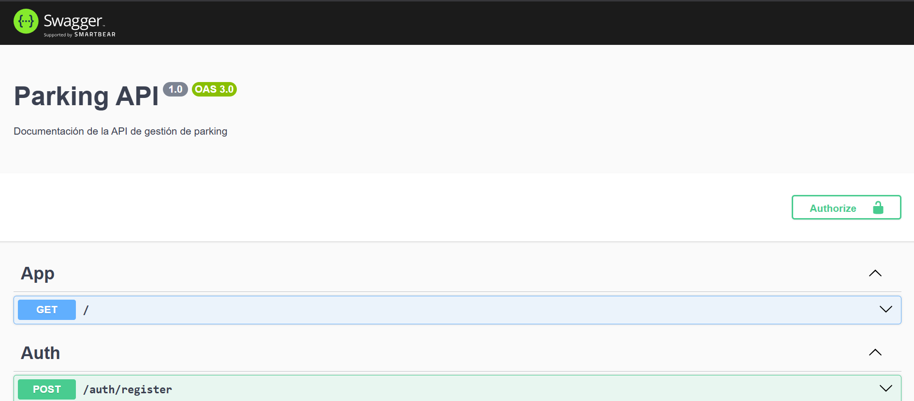
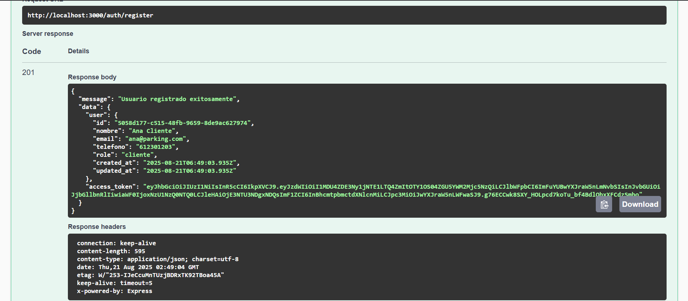
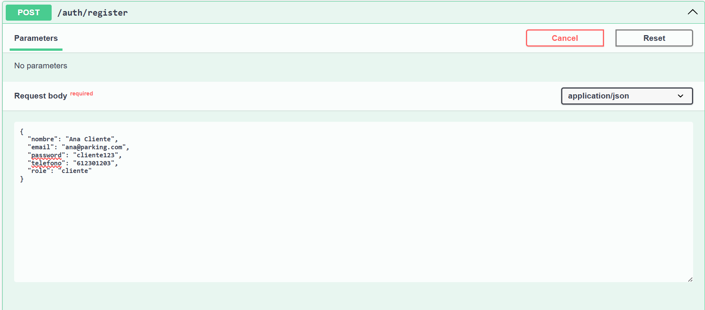
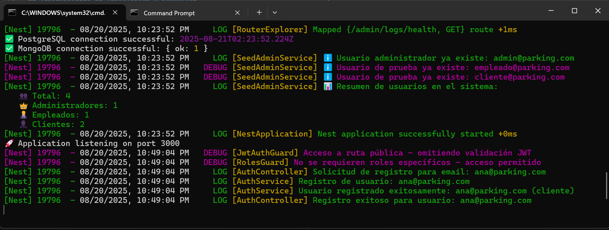

# 🚗 Parking API

## 📋 Project Description

RESTful API built with Node.js and NestJS for complete management of a parking system. The application allows booking parking spaces for vehicles, checking current occupancy, managing users with administrative roles, employees and customers, and accessing detailed audit logs. It uses JWT-based authentication and role-based authorization to control access to functionalities. Persistence combines PostgreSQL for main entities and MongoDB to store activity logs.

---

## Steps to run the project locally

### Prerequisites

- Node.js (version 18 or higher recommended)
- npm or pnpm as package manager
- PostgreSQL installed and running
- MongoDB installed and running
- Correct configuration of environment variables (see `.env`)

### Clone the repository

```bash
git clone https://github.com/carlosdanielclark/parking-api
```

### Database configuration

1. Create the database in PostgreSQL (e.g. `parking_db`).

```bash
createdb parking_db
```

2. Ensure MongoDB is running and accessible (configured by default at `localhost:27017`).

### Environment variables

Make sure to configure the `.env` file in the project root with the following values adjusted to your environment:

```
# PostgreSQL Configuration

POSTGRES_HOST=localhost
POSTGRES_PORT=5432
POSTGRES_USERNAME=
POSTGRES_PASSWORD=
POSTGRES_DATABASE=parking_db

# MongoDB Configuration

MONGODB_HOST=localhost
MONGODB_PORT=27017
MONGODB_DATABASE=parking_mongo

# JWT Configuration
JWT_SECRET=
JWT_EXPIRATION_TIME=

# Application Configuration

PORT=3000
NODE_ENV=development

```


### Install dependencies

Run the command to install all dependencies:

```
npm install
```
or if you use pnpm:

```bash
pnpm install
```

### (Optional) Run migrations and seed initial data

If migration or seed scripts exist, run them to create schemas and initial users (includes admin and test users).

```bash
pnpm run migration:run     # or the equivalent configured command
pnpm run seed              # to create admin, employee and client users
```
### Start the application locally

Start the NestJS server:

```bash
pnpm run start:dev
```

The server will listen by default at `http://localhost:3000`.

To see Swagger:

 * Navigate to http://localhost:3000/api/docs

### API Usage

- Registration and login: endpoints `/auth/register` and `/auth/login`.
- User management: `/users` (depending on permissions).
- Reservations: `/reservas`.
- Occupancy query: `/ocupacion`.
- Parking spaces management: `/plazas`.
- Vehicles management: `/vehiculos`.
- Administrative logs under `/admin/logs`.

### Note about E2E tests

Automated end-to-end tests are included using Jest and Supertest. To run the full suite:

```bash
pnpm run test:e2e
```

This ensures all use cases work correctly in a controlled environment.

---

For advanced details, you can consult the more detailed technical documentation in the repository or the source code comments in the `src/` folder.

---

This project provides a robust and secure system for comprehensive parking management, combining a modular architecture with authentication, roles and complete auditing with logs stored in MongoDB.

---
## Images 


---



---



---


